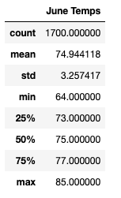
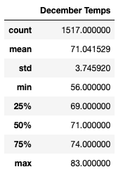

# **Module9-surfs_up**
## **SQLite, SQLAlchemy, and Flask**

### **Overview of the statistical analysis**

#### The purpose of this analysis is to have better understanding of the temperature trend in Oahu, Hawaii as temperature changes could affect the sustainability of the surf and ice cream shop business throughout the year.

#### The analysis was done by getting basic statistical data of the temperatures for summer in June and winter in December.  The goal is to look at the statistical data and determine if there are big differences in temperature during the summer and winter season.

### **Results**

#### Below are temperature summary statistics for June and December:

#### From looking at the data, there are not a lot of significant differences in temperature changes in Oahu for the months of June and December.
     The biggest differences in weather are:
        1. Minimum temperature is 64 in June vs 56 in December
        2. Standard Deviation  3.26 in June vs 3.75 in December
        3. Average temperature is 74.9 in June vs 71.0 in December 

### **Summary**

#### In conclusion, the weather temperature in Oahu, Hawaii is pretty much stable and does not fluctuate significantly throughout the year.  The island has warm to hot temperature almost all year long.  So it would be a perfect location for a the surf and ice cream shop business.  However, we also want to consider creating two additional queries that measure precipitation and wind speed for both June and December as rain and windy condition might have some effect on the surf and ice cream business.
